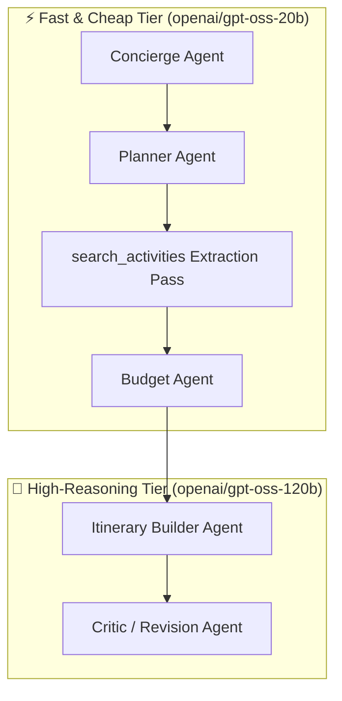
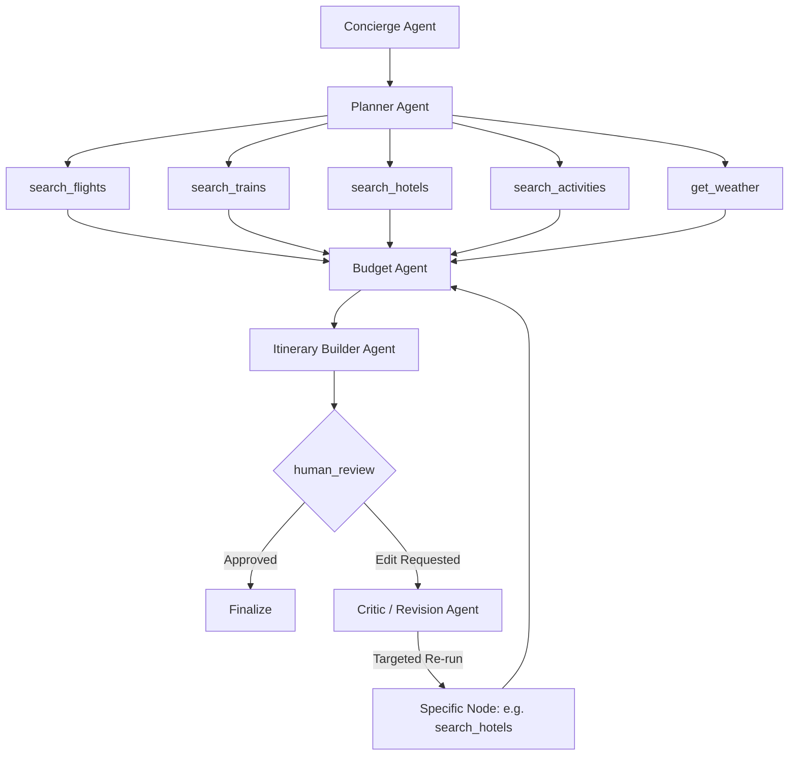

<div align="center">

# 🧭 Waypoint

### ✨ Every Great Journey Starts with a Waypoint

Waypoint is an autonomous multi-agent AI trip-planning system built specifically for **India-based domestic trips**. A traveler provides basic inputs (destination, dates, party size, budget, interests, and style); a coordinated graph of LangGraph agents plans transport, lodging, activities, weather, and budget feasibility; the system composes a realistic day-by-day itinerary; and the user refines it through an interactive chat-based review loop before finalizing.

</div>

**User flow (high level):**
```
📝 Form fill → 🚀 Session initialized → ⚙️ Multi-agent planning & search → 💬 Human review loop → 📅 Finalized itinerary & .ics export
```

---

## 🛠 Tech Stack

| Layer | Choice | Notes |
|---|---|---|
| Language | Python 3.12 | Modern type hinting, async I/O where needed |
| Package Manager | uv | Ultra-fast dependency resolution and virtual environments |
| Web Framework | FastAPI | Async endpoints for trip orchestration, polling, and revision chat |
| Multi-Agent Graph | LangGraph + LangChain | Directed stateful graph with checkpointers and conditional branches |
| Schema / Validation | Pydantic v2 | Strict JSON schema generation for structured outputs and state contracts |
| LLM Provider | Groq | **Multi-tier model routing** to strictly respect Groq's 8,000 TPM limit |
| Database | PostgreSQL | App entities (`trips`, `itineraries`) + LangGraph state checkpointer |
| ORM & Migrations | SQLAlchemy 2.0 + Alembic | Asynchronous and synchronous DB sessions |
| Checkpointer | `langgraph-checkpoint-postgres` | Persists execution state at `human_review` across browser refreshes |
| Frontend | Vanilla HTML5 / CSS3 / JS | Zero-build, lightweight, fast client-side rendering |
| Font & Icons | Satoshi | Clean modern typography via Fontshare CDN |

---

## 🧠 Multi-Model & TPM Optimization Architecture

To prevent HTTP 429 rate-limit starvation on Groq's 8,000 TPM free tier, Waypoint implements an intelligent **multi-tier model strategy**:



1. **Fast Tier (`openai/gpt-oss-20b`)**: Handles canonicalization, mode prioritization, budget floor math, and listicle extraction.
2. **Reasoning Tier (`openai/gpt-oss-120b`)**: Reserved strictly for high-context tasks requiring deep chronological scheduling, day-splitting, and natural language revision interpretation.
3. **Reasoning Control**: Bounded `reasoning_effort="low"` and right-sized `AGENT_MAX_TOKENS` prevent runaway reasoning chains from exhausting token budgets.
4. **Native Schema Validation**: All calls use `method="json_schema"` with explicit one-shot examples, completely eliminating Groq `json_validate_failed` and backtick formatting errors.

---

## 🔌 Tool Integrations & Mechanical Data Fetching

Tool nodes are strictly mechanical and fail loud (returning structured diagnostic notes rather than silent empty lists). Car and bus modes are intentionally deferred to prioritize flight and rail coverage.

| Tool Node | Provider | Scope | Engineering Highlights |
|---|---|---|---|
| `search_flights` | SerpApi | Flights | Google Flights engine; resolves IATA codes via auto-stripped city names; multi-passenger group aggregate pricing; extracts aircraft models and booking tokens. |
| `search_trains` | RailRadar | Trains | Real-time Indian Railways schedules and fare breakdowns; group fare calculation (`base_fare * num_travelers`); RailRadar autocomplete fallback with in-memory caching; 6s throttle with 429 circuit-breaker. |
| `search_hotels` | SerpApi | Hotels | Google Hotels engine; location and budget-tier filtering for quality stays. |
| `search_activities` | Tavily + LLM | Points of interest | Fast Tavily basic search merged and deduped, followed by discrete activity extraction via fast LLM tier. |
| `get_weather` | Open-Meteo | Forecasts | **16-day live forecast horizon**; 2-tier geocoding (`admin1` vs `name`) to accurately resolve Indian states (Goa, Kerala); seasonal climate estimate fallback for trips >16 days. |
| `search_buses` | ⏳ Deferred | Buses | Stubs preserved; deferred in Planner to focus on core rail & flight routing. |
| `search_cars` | ⏳ Deferred | Rental cars | Stubs preserved; deferred in Planner. |

*All external HTTP tools are wrapped with `tenacity` exponential backoff retries for transient failure resilience.*

---

## 🤖 Agents & Roles



| Agent | Responsibilities |
|---|---|
| `Concierge` | Validates and canonicalizes raw form inputs into standardized formats (`"Mumbai, India"`). Replaced multi-round interrupt loops with deterministic one-pass normalization. |
| `Planner` | Decides transport modes and budget tier (`tight`, `balanced`, `luxury`). Deferrals keep searches lean. |
| `Budget` | Evaluates group transport totals against accommodation and activities to establish a conservative feasibility floor. |
| `Itinerary Builder` | Synthesizes tool outputs into day-by-day chronological events. Enforces early-morning arrival check-ins, pace density, and authentic place naming. |
| `Critic` | Parses user feedback during review, determining whether to trigger targeted data refetches (e.g. new hotel) or pure in-memory itinerary rearrangement. |

---

## 🖥 Frontend Features & UI Enhancements

The client interface is completely dependency-free, modern, and mobile-responsive:

1. **Interactive Route & Destination Maps**: Embedded interactive mapping (`frontend/js/map-render.js`) visualizing transit paths and scheduled activity clusters.
2. **1-Click Calendar Export (`.ics`)**: Client-side iCalendar generator (`frontend/js/calendar-export.js`) allowing travelers to sync their finalized trip directly into Google Calendar, Apple Calendar, or Outlook.
3. **Context-Aware Wikipedia Imagery**: High-relevance Wikipedia photo matching in `itinerary-render.js` with smart heuristic filters excluding SVG diagrams, locator maps, and flag icons.
4. **Layout Grid Fixes**: Fixed CSS grid layout between the day timeline and interactive sticky map container; resolved price overlap bugs in the trip summary card.
5. **Offline Demo / Sample Packages**: Pre-built static itinerary samples (`frontend/samples/`) enabling instant design testing and UI demos without consuming API quota.

---

## 📋 State Schema (`TripState`)

A unified `TypedDict` that flows through every node in the graph:

```python
class TripState(TypedDict):
    # Form Inputs
    trip_id: str
    destination: str
    origin_city: str
    start_date: str
    end_date: str
    budget: float
    currency: str
    num_travelers: int
    interests: list[str]
    transport_pref: str        # "flights", "trains", "any"
    wants_rental_car: bool
    pace: str                  # "relaxed", "moderate", "packed"

    # Agent & Tool Outputs
    normalized_input: dict
    search_plan: dict
    flights: list[dict]
    trains: list[dict]
    buses: list[dict]
    cars: list[dict]
    hotels: list[dict]
    activities: list[dict]
    weather: list[dict]
    budget_analysis: dict
    itinerary: dict
    critic_analysis: dict

    # Review Loop & UI
    approved: bool
    messages: Annotated[list, add_messages]
    status: str
```

---

## ✅ What's Working & Verified

- **Multi-Model Routing**: Fast tier (20B) and reasoning tier (120B) running without Groq 429 rate-limit interruptions.
- **Group Budget Parity**: Multi-passenger train fares now correctly match group flight and hotel costs.
- **Reliable Geocoding & Weather**: 16-day Open-Meteo forecasts with state/city 2-tier resolution.
- **Fail-Loud Resilience**: Tenacity retries on all network calls with clear fallback diagnostic notes.
- **Streamlined Concierge**: Single-pass input normalization without blocking interrupt halts.
- **Interactive UI**: Working calendar `.ics` download, interactive map views, and verified Wikipedia image rendering.
- **Offline Backend Test Suite**: Automated 8/8 test suite (`tests/test_backend_offline.py`) verifying state transitions and tool handling offline.

---

## 🔜 Future Roadmap

- 🚌 **Bus API Integration (`search_buses`)**: Wire to live Indian bus booking APIs (e.g. RedBus/AbhiBus aggregators).
- 🚗 **Rental Car Integration (`search_cars`)**: Connect self-drive mobility providers (e.g. Zoomcar).
- 🔌 **Model Context Protocol (MCP)**: Wrap tool endpoints as standardized MCP servers.
- 🔁 **Deep Substitution in Review Mode**: Enable specific component swapping (e.g. "Keep hotel, but upgrade train to 2nd AC").