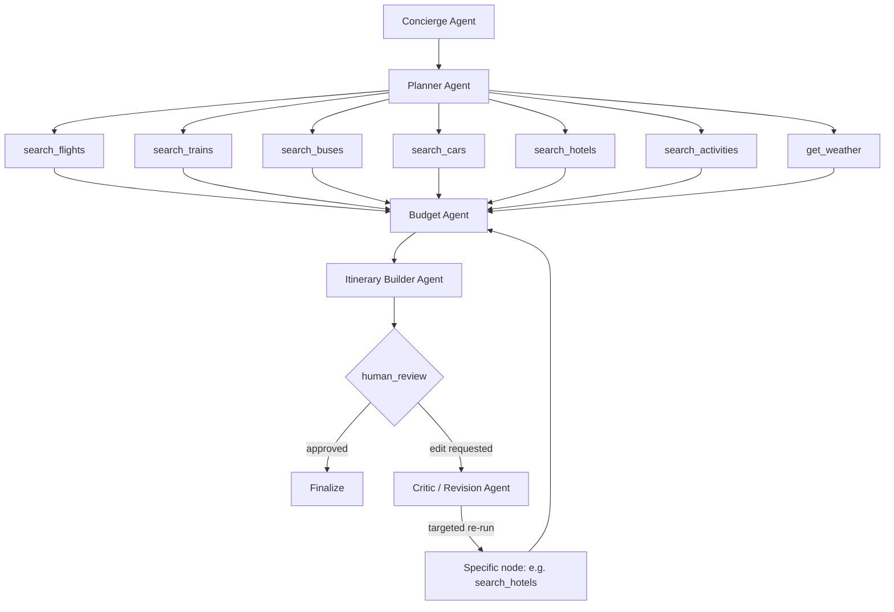

<div align="center">

# 🧭 Waypoint

### ✨ Every Great Journey Starts with a Waypoint

Waypoint is a multi-agent AI trip-planning system built for **India-based trips**. A user describes a trip through a structured form; a graph of LangGraph agents plans transport, lodging, activities, and budget; the system produces a day-by-day itinerary; and the user refines it through a chat-based review loop before finalizing.

</div>

**User flow (high level):**
```
📝 Form fill → 🚀 Trip session starts → ⚙️ Planning runs → 💬 Human review (chat loop) → ✅ Final itinerary
```

## 🛠 Tech Stack

| Layer | Choice | Notes |
|---|---|---|
| Language | Python | |
| Package manager | uv | |
| Web framework | FastAPI | Endpoints for starting a trip, submitting review feedback, fetching itinerary status/result |
| Orchestration | LangChain + LangGraph | First project using a framework instead of hand-rolled orchestration |
| Schema/validation | Pydantic | Shared state schema flowing through the graph; API request/response models |
| LLM providers | OpenAI, Groq | Groq (`openai/gpt-oss-120b`) as default; OpenAI used where needed |
| Tool protocol | MCP | Staged in after dummy → free-API phases prove the graph |
| Database | Postgres | Single instance, two roles: app tables + LangGraph checkpointer (Postgres from day 1 for V1) |
| ORM / migrations | SQLAlchemy + Alembic | App tables: `trips`, `itineraries` |
| Checkpointer | `langgraph-checkpoint-postgres` | Persists paused graph state at `human_review` so a session survives a refresh/restart |
| Frontend | Plain HTML/CSS/JS | Served statically, no build step, no framework for v1 |
| Font | Satoshi | Via Fontshare CDN |

## 🔌 External APIs

Five real-API integrations are wired up across the tool nodes. Cars and buses are deferred for now.

| Tool node | Provider | Scope | Notes |
|---|---|---|---|
| `search_flights` | SerpApi | Flights | Google Flights results via SerpApi |
| `search_hotels` | SerpApi | Hotels | Google Hotels results via SerpApi |
| `search_trains` | RailRadar | Trains | Live train search; station resolution strips country suffix before dict lookup; trains with `price <= 0` are filtered out before prompt assembly to prevent 413 payload errors |
| `search_activities` | Tavily | Activities / points of interest | |
| `get_weather` | Open-Meteo | Forecast for trip dates | |
| `search_buses` | ⏳ Deferred | — | Stub remains; not wired to a real API yet |
| `search_cars` | ⏳ Deferred | — | Stub remains; not wired to a real API yet |

## 🤖 Agents

| Agent | Description |
|---|---|
| `Concierge` | Takes the raw trip form input and turns it into clean, validated state. Enforces a hard trip-length cap before any LLM call. |
| `Planner` | Decides what to search, and in what priority order, based on the normalized input and budget. |
| `Budget` | Sums total planned cost against the user's stated budget. |
| `Itinerary` | Composes the day-by-day plan from every tool node's results plus the budget analysis. Runs in two modes: build (initial pass) and revise (targeted edits during review). |
| `Critic` | Reads the latest user message during human_review, interprets the edit request, and routes directly to whichever node(s) actually need to re-run. |

## 🔎 Tools

Seven tool nodes, mechanical (no LLM calls). All tool nodes **fail loud** — on error they return a structured error dict instead of silently swallowing failures, and any data gaps they encounter are collected into a `data_gaps` list so the Itinerary Builder can surface them to the user.

| Node | Fetches | Status |
|---|---|---|
| `search_flights` | Flight options | ✅ SerpApi |
| `search_trains` | Train options | ✅ RailRadar |
| `search_buses` | Bus options | ⏳ Deferred |
| `search_cars` | Rental car options | ⏳ Deferred |
| `search_hotels` | Hotel options | ✅ SerpApi |
| `search_activities` | Activities / points of interest | ✅ Tavily |
| `get_weather` | Forecast for the trip dates | ✅ Open-Meteo |

Shared constants (station code maps, currency codes, etc.) live in `tools/_constants.py`.

## 📊 Graph Diagram



## 📋 State Schema (TripState)

`TypedDict`, single source of truth for the graph. Separate top-level keys
per tool result (not a grouped dict) — required for write-safety during the
parallel fan-out.

| Field | Type | Notes |
|---|---|---|
| `trip_id` | str | |
| `destination` | str | Single destination only for V1 |
| `origin_city` | str | Shared by all travelers |
| `start_date` / `end_date` | date | |
| `budget` | float | |
| `currency` | str | |
| `num_travelers` | int | |
| `interests` | list[str] | |
| `transport_pref` | str | `"flights"` / `"trains"` / `"buses"` / `"cars"` / `"any"` — single-select |
| `wants_rental_car` | bool | Independent add-on for local mobility; effectively redundant if `transport_pref` is `"cars"` |
| `pace` | str | `"relaxed"` / `"moderate"` / `"packed"` |
| `normalized_input` | dict | Concierge Agent output |
| `search_plan` | dict | Planner Agent output |
| `flights` | list[dict] | `search_flights` output |
| `trains` | list[dict] | `search_trains` output |
| `buses` | list[dict] | `search_buses` output |
| `cars` | list[dict] | `search_cars` output |
| `hotels` | list[dict] | `search_hotels` output |
| `activities` | list[dict] | `search_activities` output |
| `weather` | list[dict] | `get_weather` output |
| `budget_analysis` | dict | Budget Agent output |
| `itinerary` | dict | Itinerary Builder Agent output |
| `critic_analysis` | dict | Critic Agent output — logging only |
| `data_gaps` | list[dict] | Collected from all tool nodes; surfaced to the Itinerary Builder so the user sees what's missing |
| `approved` | bool | Drives the `human_review` conditional branch |
| `messages` | `Annotated[list, add_messages]` | Single source of truth for review-loop chat |
| `status` | str | Current node name, drives frontend progress UI |

## 🖥 Frontend

Plain HTML/CSS/JS, no framework, no build step. Four pages covering the full
user flow end to end:

| Page | Purpose |
|---|---|
| `form.html` | 3-card trip wizard (Destination & Dates, Travel Style, Budget) + a review step before submitting |
| `planning.html` | Polls trip status and shows live graph node progress as a step list |
| `review.html` | Day-by-day itinerary + chat panel for edits, quick-action chips, approve flow |
| `final.html` | Read-only finalized itinerary with download (.txt) and copy-link actions |

Shared `css/style.css` (design tokens + components) and `js/app.js` (API
base URL, fetch wrapper, date formatting) are used across all four pages;
each page also has its own thin `<page>.js` for page-specific logic.
`js/itinerary-render.js` is shared specifically between `review.html` and
`final.html`, since both render the same day-card/event structure.

Verified end to end against the live backend, including an edit-path request
that correctly routed through the Critic to a specific tool node
(`search_hotels`), re-ran Budget and the Itinerary Builder in revise mode,
and landed back at `awaiting_review` with an updated itinerary.

## ✅ Current Status

- ✅ Environment & tooling (uv, Python 3.12, Docker Postgres)
- ✅ Database layer (SQLAlchemy models + Alembic migrations, checkpointer tables)
- ✅ State schema (TripState)
- ✅ 5 of 7 tool nodes wired to real APIs — SerpApi (flights, hotels), RailRadar (trains), Tavily (activities), Open-Meteo (weather)
- ✅ Fail-loud error returns on all tool nodes + `data_gaps` collection
- ✅ Station-resolution fix (country-suffix stripping before dict lookup)
- ✅ Train pricing filter (`price > 0`) before prompt assembly to prevent 413s
- ✅ Trip-length cap guard in Concierge before any LLM call
- ✅ `AGENT_MAX_TOKENS` right-sized based on observed Groq token usage and TPM limits
- ✅ All 5 reasoning agents + Command-based Critic routing
- ✅ Graph fully wired (StateGraph, human_review interrupt, checkpointer — approve path, edit-request path, invalid-target error path all tested)
- ✅ FastAPI layer — `POST /trips`, `GET /trips/{id}/status`, `GET /trips/{id}/itinerary`, `POST /trips/{id}/review` (approve + edit tested against live graph)
- ✅ Frontend — all 4 pages built and tested end to end against the live backend
- ✅ Per-tool integration test harnesses and debug scripts under `scripts/`

## 🔜 Remaining Work

- ⚒️ Refining and Refactoring the waypoint system
- 🚌 `search_buses` real API integration (stub remains; dummy data returns hardcoded dates regardless of trip dates)
- 🚗 `search_cars` real API integration (stub remains)
- 🔌 MCP tools stage
- 🔄 Substitution-type edits in revise mode (e.g. "cheaper hotel," "swap to train") — needs the reviser to receive a fuller data slice than just the previous itinerary
- 📝 `search_buses` dummy data needs to be date-aware before it's demo-ready
