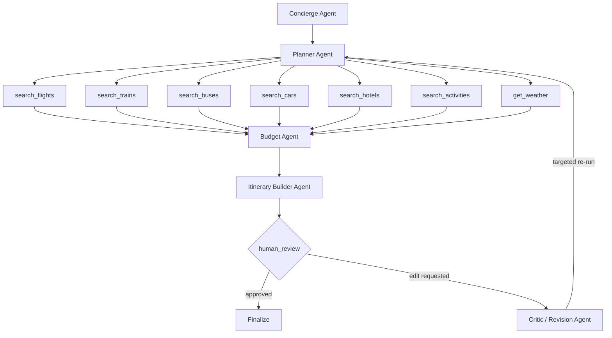

<div align="center">

# Waypoint

### Every Great Journey Starts with a Waypoint


Waypoint is a multi-agent AI trip-planning system. A user describes a trip through a structured form; a graph of LangGraph agents plans transport, lodging, activities, and budget; the system produces a day-by-day itinerary; and the user refines it through a chat-based review loop before finalizing.


</div>


**User flow (high level):**
```
Form fill → Trip session starts → Planning runs → Human review (chat loop) → Final itinerary
```


## Tech Stack


| Layer | Choice | Notes |
|---|---|---|
| Language | Python | |
| Package manager | uv | |
| Web framework | FastAPI | Endpoints for starting a trip, submitting review feedback, fetching itinerary status/result |
| Orchestration | LangChain + LangGraph | First project using a framework instead of hand-rolled orchestration |
| Schema/validation | Pydantic | Shared state schema flowing through the graph; API request/response models |
| Retry logic | Tenacity | Wraps tool/API calls for transient failures |
| Tool protocol | MCP | Staged in after dummy → free-API phases prove the graph |
| LLM providers | OpenAI, Groq | Groq (`openai/gpt-oss-120b`) as default; OpenAI as fallback/alternative where needed |
| Search / activities | Tavily | Free-API stage for activity search |
| Database | Postgres | Single instance, two roles: app tables + LangGraph checkpointer (Postgres from day 1 for V1) |
| ORM / migrations | SQLAlchemy + Alembic | App tables: `trips`, `itineraries` |
| Checkpointer | `langgraph-checkpoint-postgres` | Persists paused graph state at `human_review` so a session survives a refresh/restart |
| Frontend | Plain HTML/CSS/JS | Served via FastAPI, no separate build step — no framework for v1 |
| Font | Satoshi | Via Fontshare CDN |


## Agents


| Agents | Descriptions |
|---|---|
| `Concierge` | Takes the raw trip form input and turns it into clean, validated state. |
| `Planner` | Decides what to search, and in what priority order, based on the normalized input and budget. |
| `Budget` | Sums total planned cost against the user's stated budget. |
| `Itinerary` | Composes the day-by-day plan from every tool node's results plus the budget analysis. |
| `Critic` | Reads the latest user message during human_review and interprets the edit request. |


## Tools

Seven tool nodes, mechanical (no LLM calls), staged dummy → free API → MCP

| Node | Fetches |
|---|---|
| `search_flights` | Flight options |
| `search_trains` | Train options |
| `search_buses` | Bus options |
| `search_cars` | Rental car options |
| `search_hotels` | Hotel options |
| `search_activities` | Activities / points of interest |
| `get_weather` | Forecast for the trip dates |


## Graph Diagram
 



## State Schema (TripState)
 
`TypedDict`, single source of truth for the graph. Separate top-level keys
per tool result (not a grouped dict) — required for write-safety during the
parallel fan-out.
 
| Field | Type | Notes |
|---|---|---|
| `trip_id` | str | |
| `destination` | str | Single destination only for V1 |
| `origin_city` | str | Shared by all travelers |
| `start_date` / `end_date` | date | |
| `budget` | float | |
| `currency` | str | |
| `num_travelers` | int | |
| `interests` | list[str] | |
| `transport_pref` | str | `"flights"` / `"trains"` / `"buses"` / `"cars"` / `"any"` — single-select |
| `wants_rental_car` | bool | Independent add-on for local mobility; effectively redundant if `transport_pref` is `"cars"` |
| `pace` | str | `"relaxed"` / `"moderate"` / `"packed"` |
| `normalized_input` | dict | Concierge Agent output |
| `search_plan` | dict | Planner Agent output |
| `flights` | list[dict] | `search_flights` output |
| `trains` | list[dict] | `search_trains` output |
| `buses` | list[dict] | `search_buses` output |
| `cars` | list[dict] | `search_cars` output |
| `hotels` | list[dict] | `search_hotels` output |
| `activities` | list[dict] | `search_activities` output |
| `weather` | list[dict] | `get_weather` output |
| `budget_analysis` | dict | Budget Agent output |
| `itinerary` | dict | Itinerary Builder Agent output |
| `critic_analysis` | dict | Critic Agent output — logging only |
| `approved` | bool | Drives the `human_review` conditional branch |
| `messages` | `Annotated[list, add_messages]` | Single source of truth for review-loop chat |
| `status` | str | Current node name, drives frontend progress UI |


### Current Status 

- Tool Nodes
- Prompts
- Models
- Main Langraph State
- Initial Docker and Postgres setup


### Remaining Work

- Agent Nodes
- Graph Wiring
- Frontend
- Some Database and Backend work
- APIs
